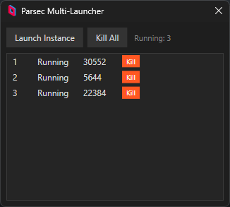

# Parsec Multi Client

A Lightweight windows application that allows you to run multiple instances of # [Parsec](https://parsec.app) Multi Client simultaneously.
## Screenshot

## Features

- Launch multiple Parsec instances independently
- Each instance runs with its own configuration
- Simple WPF interface for managing instances
- Automatically packages required Parsec files

## Requirements

- Windows 10/11
- .NET 8.0 Runtime (or SDK for building)
- Visual Studio 2022 or later (for building from source)
